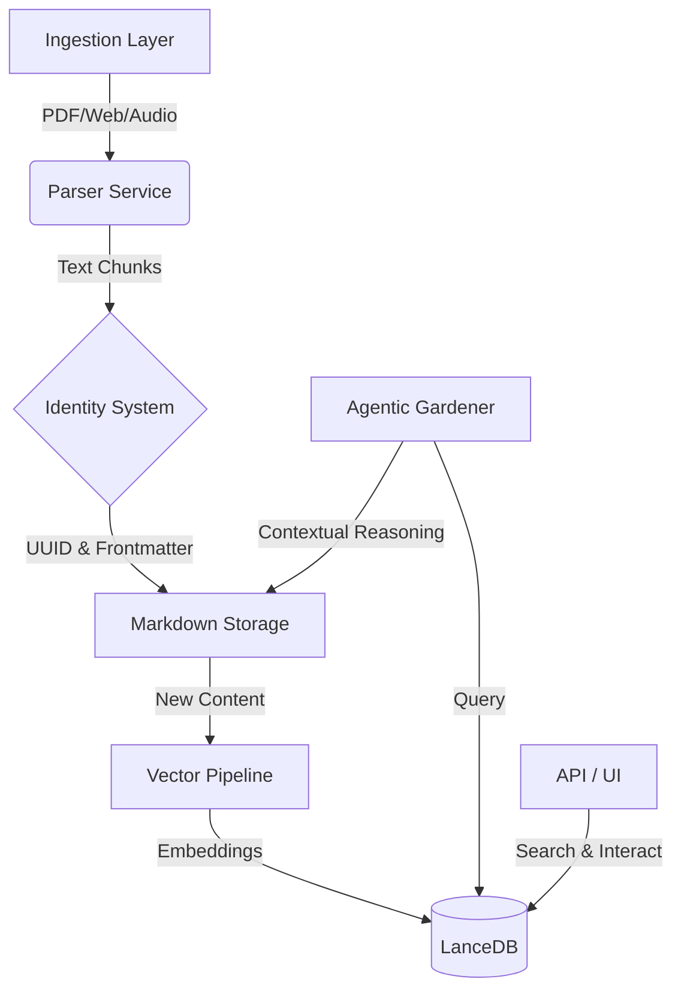

# Zettlecast: Privacy-First AI Knowledge Middleware

## Project Overview

Zettlecast is a comprehensive "Digital Zettelkasten" solution that serves as a bridge between raw unstructured data and structured knowledge. It provides a robust backend for ingesting documents, transcribing audio, and clipping web content, all while maintaining a permanent, immutable identity for every piece of information.

### Key Features

- **🛡️ Privacy-First Architecture**: Zero data exfiltration. All embeddings, inference, and storage occur locally on the device.
- **📄 Tiered Ingestion Pipeline**: Intelligent parsing strategy that balances speed and accuracy (e.g., pypdf → Marker OCR for complex PDFs).
- **🧠 Advanced Semantic Search**: Utilizes `embeddinggemma-300m` for retrieval and `bge-reranker-v2-m3` for high-precision cross-encoding.
- **🤖 Agentic "Gardener" System**: A background process that proactively suggests semantic links between notes, simulating an automated research assistant.
- **🆔 Immutable Identity**: Universally Unique Identifier (UUID) enforcement for all artifacts, ensuring resilient reference integrity across file movements or renames.

## Technical Architecture

### Core Components



### Data Pipeline & Security

1.  **Ingestion & Parsing**:
    - **PDF**: Implements a fail-over strategy, attempting standard extraction first and escalating to OCR/VLMs (Visual Language Models) only when text density is low.
    - **Audio**: Uses `faster-whisper` for local, privacy-preserving transcription.
    - **Web**: `Trafilatura` based extraction for clean, content-focused web clipping.

2.  **Vector Search & RAG**:
    - **Embedding**: 1024-dimensional vectors via `EmbeddingGemma`.
    - **Storage**: `LanceDB` for high-performance, serverless vector storage.
    - **Reranking**: Semantic candidates are re-scored using a Cross-Encoder to maximize relevance before presentation.

3.  **Trust & Verification**:
    - **Rejected Edges**: The system learns from user feedback. If a suggested link is rejected, it is recorded in a "negative constraints" table to prevent future hallucinations of that specific connection.

## Quick Start

### Prerequisites
- Python 3.10+
- `ffmpeg` (for audio processing)

### Installation

**macOS / Linux**
```bash
git clone https://github.com/XonDesk/Zettlecast.git
cd Zettlecast
./setup.sh
```

**Windows**
```powershell
git clone https://github.com/XonDesk/Zettlecast.git
cd Zettlecast
.\setup.ps1
```

### Running the System

Start the API server, UI, and background services:

```bash
# macOS/Linux
./run.sh

# Windows
.\.venv\Scripts\Activate.ps1
zettlecast serve
```

Access the interfaces:
- **Dashboard (Streamlit)**: `http://localhost:8501`
- **REST API (FastAPI)**: `http://localhost:8000/docs`

## Usage & Workflows

### CLI Operations
The system includes a robust CLI for headless operation and automation:

```bash
# Ingest a directory of research papers
zettlecast ingest ./papers/

# Quick-add a security whitepaper URL
zettlecast add https://example.com/security-architecture

# Semantic search for specific concepts
zettlecast search "automated threat modeling"
```

### API Integration
All endpoints are secured via a bearer token generated at install time.

- `POST /ingest`: Upload documents or URLs for processing.
- `GET /search`: RAG-ready semantic search endpoint.
- `GET /notes/{uuid}`: Retrieve content with AI-suggested context.

## Configuration

Configuration is managed via `.env` to support various deployment environments (Dev, Test, Prod).

```env
# Infrastructure
STORAGE_PATH=~/_BRAIN_STORAGE
LANCEDB_PATH=~/_BRAIN_STORAGE/.lancedb

# AI Models (Local)
EMBEDDING_MODEL=google/embeddinggemma-300m
RERANKER_MODEL=BAAI/bge-reranker-v2-m3
WHISPER_MODEL=medium

# Privacy Controls
ENABLE_CONTEXT_ENRICHMENT=false # Off by default to prevent LLM latency
```

## License

MIT License. Designed for open innovation and strictly local usage.
