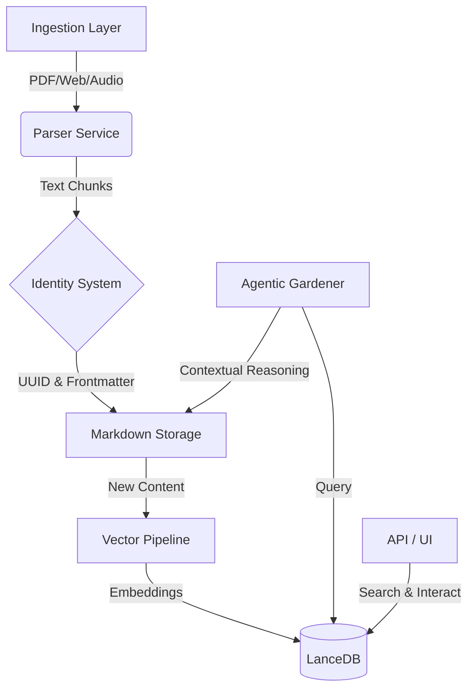

# Zettlecast: Privacy-First AI Knowledge Middleware

## Project Overview

Zettlecast is a comprehensive "Digital Zettelkasten" solution that serves as a bridge between raw unstructured data and structured knowledge. It provides a robust backend for ingesting documents, transcribing audio, and clipping web content, all while maintaining a permanent, immutable identity for every piece of information.

### Key Features

- **🛡️ Privacy-First Architecture**: Zero data exfiltration. All embeddings, inference, and storage occur locally on the device.
- **📄 Tiered Ingestion Pipeline**: Intelligent parsing strategy that balances speed and accuracy (e.g., pypdf → Marker OCR for complex PDFs).
- **🧠 Advanced Semantic Search**: Utilizes `embeddinggemma-300m` for retrieval and `bge-reranker-v2-m3` for high-precision cross-encoding.
- **🤖 Agentic "Gardener" System**: A background process that proactively suggests semantic links between notes, simulating an automated research assistant.
- **🆔 Immutable Identity**: Universally Unique Identifier (UUID) enforcement for all artifacts, ensuring resilient reference integrity across file movements or renames.

## Technical Architecture

### Core Components



### Data Pipeline & Security

1.  **Ingestion & Parsing**:
    - **PDF**: Implements a fail-over strategy, attempting standard extraction first and escalating to OCR/VLMs (Visual Language Models) only when text density is low.
    - **Audio**: Uses `faster-whisper` for local, privacy-preserving transcription.
    - **Web**: `Trafilatura` based extraction for clean, content-focused web clipping.

2.  **Vector Search & RAG**:
    - **Embedding**: 1024-dimensional vectors via `EmbeddingGemma`.
    - **Storage**: `LanceDB` for high-performance, serverless vector storage.
    - **Reranking**: Semantic candidates are re-scored using a Cross-Encoder to maximize relevance before presentation.

3.  **Trust & Verification**:
    - **Rejected Edges**: The system learns from user feedback. If a suggested link is rejected, it is recorded in a "negative constraints" table to prevent future hallucinations of that specific connection.

## Requirements

- **Python 3.11 or 3.12** (required for NeMo/ML library compatibility)
  - ⚠️ Python 3.13+ is NOT supported
- **FFmpeg** (for audio transcription)
- **CUDA GPU** (recommended for NeMo transcription, optional)

## Quick Start

### Prerequisites
- Python 3.10+
- `ffmpeg` (for audio processing)

### Installation

**macOS / Linux**
```bash
# Install Python 3.11 if needed
# macOS: brew install python@3.11
# Linux: sudo apt install python3.11 python3.11-venv

# Clone the repo
git clone https://github.com/XonDesk/Zettlecast.git
cd Zettlecast
./setup.sh
```

**Windows**
```powershell
# Requires Python 3.11 - download from:
# https://www.python.org/downloads/release/python-3119/

# Clone the repo
git clone https://github.com/XonDesk/Zettlecast.git
cd Zettlecast
.\setup.ps1
```

### Running the System

Start the API server, UI, and background services:

```bash
# macOS/Linux
./run.sh

# Windows
.\.venv\Scripts\Activate.ps1
zettlecast serve
```

Access the interfaces:
- **Dashboard (Streamlit)**: `http://localhost:8501`
- **REST API (FastAPI)**: `http://localhost:8000/docs`

## Usage & Workflows

## Features

- 📄 **PDF Ingestion** - Tiered parsing (pypdf → Marker → Docling)
- 🌐 **Web Clipping** - Ingest any URL via bookmarklet
- 🎙️ **Audio Transcription** - Faster-Whisper (default) or NVIDIA NeMo (parallel)
- 🔍 **Semantic Search** - EmbeddingGemma-300M + BGE reranker
- 🔗 **Link Suggestions** - AI-powered "Gardener" finds related notes
- 📊 **Graph View** - Visualize connections with Cytoscape.js

### CLI Operations
The system includes a robust CLI for headless operation and automation:

```bash
# Ingest a directory of research papers
zettlecast ingest ./papers/

# Quick-add a security whitepaper URL
zettlecast add https://example.com/security-architecture

# Search
zettlecast search "machine learning"
zettlecast search "automated threat modeling"

# Get your bookmarklet
zettlecast token

# View stats
zettlecast stats

# Podcast transcription
zettlecast podcast add /path/to/audio/files
zettlecast podcast run
zettlecast podcast status
```

### API Integration
All endpoints are secured via a bearer token generated at install time.

- `POST /ingest`: Upload documents or URLs for processing.
- `GET /search`: RAG-ready semantic search endpoint.
- `GET /notes/{uuid}`: Retrieve content with AI-suggested context.

## Configuration

Copy `.env.example` to `.env` and customize.

### Podcast Transcription

Zettlecast supports two transcription pipelines for audio processing:

#### 1. Whisper Pipeline (Default)
- **Model**: `faster-whisper` (large-v3-turbo by default)
- **Pros**: Lightweight, works on CPU, simple setup
- **Cons**: No speaker diarization, slower on large files
- **Setup**: Included by default, no extra installation needed

**Usage:**
```bash
zettlecast podcast add /path/to/audio
zettlecast podcast run  # Uses Whisper by default
```

#### 2. NeMo Pipeline (Faster & Parallel)
- **Models**: 
  - `nvidia/parakeet-tdt-0.6b-v2` for transcription
  - `diar_msdd_telephonic` for speaker diarization
- **Pros**: Fast (60 min audio in ~2 sec), speaker diarization, word-level timestamps, parallel processing
- **Cons**: Requires more disk space (~5GB), Python 3.11/3.12 only, GPU recommended
- **Pipeline**: Audio chunked into 10-min segments, transcription & diarization run in parallel per chunk

**Requirements for NeMo:**
- **Python 3.11 or 3.12** (NeMo does not support Python 3.13+)
- **CUDA GPU** (recommended, CPU works but slower)
- **~5GB disk space** for models
- **FFmpeg** (required for audio processing)

**Installation:**

Option 1: During setup (recommended)
```bash
# The setup script will ask if you want to install podcast support
./setup.sh      # macOS/Linux
.\setup.ps1     # Windows
```

Option 2: Manual installation
```bash
# Activate your virtual environment first
source .venv/bin/activate  # macOS/Linux
# or
.\.venv\Scripts\Activate.ps1  # Windows

# Install podcast dependencies
pip install -e ".[podcast]"

# Windows only: Apply NeMo compatibility patch
python scripts/patch_nemo_windows.py
```

**macOS/Linux Note:**
The setup script automatically applies compatibility checks for NeMo on your platform.

**Windows Note:**
NeMo has a known issue with `signal.SIGKILL` on Windows. The setup script automatically applies a patch. If you install manually, run `python scripts/patch_nemo_windows.py` after installing.

**Enable NeMo:**
Add to your `.env` file:
```env
USE_NEMO=true
```

Or use the command-line flag:
```bash
# Use NeMo for this run even if USE_NEMO=false
zettlecast podcast run --use-nemo
```

### Standard Configuration

Configuration is managed via `.env` to support various deployment environments (Dev, Test, Prod).

```env
# Infrastructure
STORAGE_PATH=~/_BRAIN_STORAGE
LANCEDB_PATH=~/_BRAIN_STORAGE/.lancedb

# Embedding & Search
EMBEDDING_MODEL=google/embeddinggemma-300m
RERANKER_MODEL=BAAI/bge-reranker-v2-m3

# Audio Transcription
# Default pipeline: Whisper (faster-whisper, included)
WHISPER_MODEL=large-v3-turbo
WHISPER_DEVICE=cuda  # or 'cpu' for CPU-only

# NeMo Pipeline (Optional - Faster & Parallel + Speaker Diarization)
# Requires: pip install -e ".[podcast]"
USE_NEMO=false  # Set to true to use NeMo instead of Whisper
NEMO_CHUNK_DURATION_MINUTES=10
NEMO_PARAKEET_MODEL=nvidia/parakeet-tdt-0.6b-v2
NEMO_DIARIZATION_MODEL=diar_msdd_telephonic

# LLM Provider (for context enrichment & podcast enhancement)
LLM_PROVIDER=ollama
OLLAMA_MODEL=llama3.2:3b
OLLAMA_BASE_URL=http://localhost:11434

# Privacy Controls
ENABLE_CONTEXT_ENRICHMENT=false # Off by default to prevent LLM latency
```

## License

MIT License. Designed for open innovation and strictly local usage.
